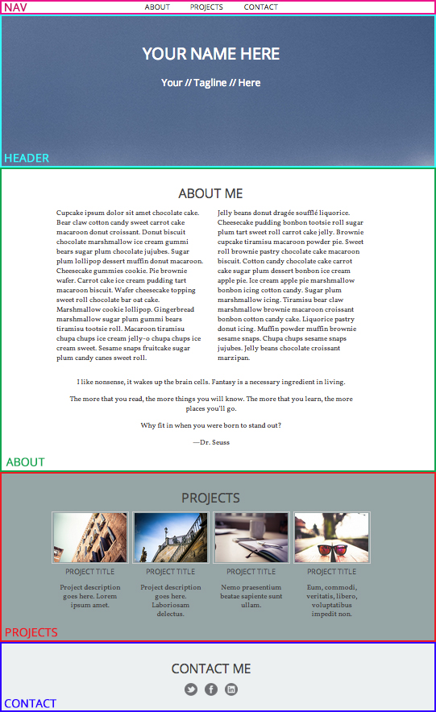

##HTML Page Structure

An important part of creating a web page is planning how to structure the page using semantic markup and getting it ready to be styled by CSS.

There are many structural HTML tags that are used just for this purpose. 

Let's take a look at an example design and plan how related elements can be grouped for styling.

Let's first look at the design here: [HackerYou demo](http://demos.hackeryou.com/html-css).

Here's how we can plan each section of the page:

##Review: `div`
The `
` tag is one of the few tags that has **no semantic meaning**. It is used purely for grouping elements to define sections to be styled and have been the foundation for laying out a page.

Based on the planning of the image above, we can use `
` tags and the `class` *attribute* to group the content in our HTML to get them ready to be styled as related grouped elements.

Your HTML will look something like this:
	
	

		<h1>Your Name Here</h1>
		<h2>Your // Tagline // Here</h2>
	

		
	

		<ul>
			<li><a href="#about">About</a></li>
			<li><a href="#projects">Projects</a></li>
			<li><a href="#contact">Contact</a></li>
		</ul>
	

		
	

		...
	

	
	...

**Note:** Be careful of "divitis"! Use the `
` to *group* related elements to be styled *together* as one section.  If you need to style a single element, like an `<h1>` for example, just style that element directly. The browser sees every element as a "box" anyway so there's no need to put a box around a box!

##HTML5 Structural Elements

The introduction of HTML5 also introduce a number of semantic tags that better describe larger blocks of content such as `header`, `footer`, `nav`, and `section`. Like previous HTML tags, each of these new structural tags have a specific meaning. 

Using the previous example, using HTML5 tags would look something like this: 

	<header>
		<h1>Your Name Here</h1>
		<h2>Your // Tagline // Here</h2>
	</header>
		
	<nav>
		<ul>
			<li><a href="#about">About</a></li>
			<li><a href="#projects">Projects</a></li>
			<li><a href="#contact">Contact</a></li>
		</ul>
	<nav>
		
	<section class="about">
		...
	</section>
	
	...

When in doubt whether the tag properly describes the content or there are no tags that properly describes the content, it's ok to continue to use divs.

**Additional resource:**  
[http://html5doctor.com/](http://html5doctor.com/)  
[HTML5 Sectioning Elements: flow chart](http://html5doctor.com/downloads/h5d-sectioning-flowchart.png)

##Review: Floats

Remember, block-style HTML elements like `
`, `
` and `<section>` automatically start on a new line and stack on top of each other. To get two block elements to align side-by-side, use the `float` property. CSS floats can float elements left or right.

However, we have to break the stacking flow when an element is floated. This will cause any element after the floated element to move up beside it, because we've disrupted the flow of the rectangular stacked boxes.

**Note:** If there is no width set, the element will float but the width will automatically be the width of its content.

###Clearing Floats

You may notice that floats have the ability to affect the rest of the web page in unexpected ways. It's important to always clear your floats and restore the stacking order of the page back to normal.

On the element that comes *directly after* the last floated element, the float can be cleared by using the property and value, `clear: both`.

	div {
    	clear: both;
	}
	
If the elements that are floating can't be cleared because there is no element following the *floated* elements, you can you apply or `overflow: hidden;` to the *parent* container to *self-clear* the floated children. Alternatively, you can use the `clearfix` hack too.  

These methods will force the element to "contain" any floated children, so that they don't disrupt the elements that come after them.

Download the <a href="exercises/page-layout.zip" class="exercises">exercise files</a> for today's code along. We'll be doing some basic page layout and full bleed background images.

