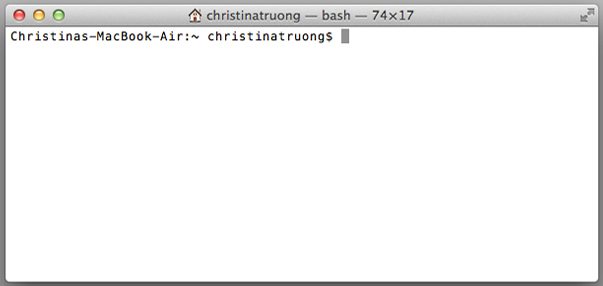
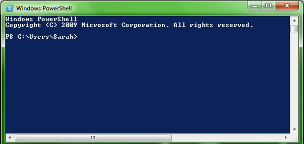

# Intro to Command Line

The command line (**Terminal** in Mac, **Powershell** in PC) is a tool that allows us to interact *directly* with the operating system. The Operating System's *user interface* is pretty much just a visual layer on top of the command line. We can run tasks that the UI does through the command line (i.e. open files, edit files, delete files, run programs). 

## User Interface
A user interface, also called a "UI" or simply an "interface," is the means in which a person controls a software application or hardware device. A good user interface provides a "user-friendly" experience, allowing the user to interact with the software or hardware in a natural and intuitive way.

Nearly all software programs have a graphical user interface, or GUI. This means the program includes graphical controls, which the user can select using a mouse or keyboard. A typical GUI of a software program includes a menu bar, toolbar, windows, buttons, and other controls. 

## Why should a front-end developer learn to use the command line?

* Tools like Git often rely on you being comfortable with the command line (even when GUIs are available to use).
* Production servers (i.e. your web host) don't have a user interface so knowing how to use the command line will be handy.
* Many tools that speed up development rely on the command line (e.g. Grunt, Sass/Less).
* You'll feel like a hacker and that's super awesome.

## Opening the command line

For Mac users, open the application called **Terminal**:

* Applications -> Utilities -> Terminal (or search for it in Spotlight)
   
For Windows, open the application called **Powershell**:

* Start -> Search programs and files -> type "powershell" and hit enter

What you should see is a relatively blank window. Terminal (Mac) has a white background and the Powershell (Windows) has a blue/black background, by default.

Terminal (Mac)

Powershell (Windows)

### The prompt

Think of the command line as a direct interface to your computer. You give it one instruction, it **R**eads it, **E**xecutes it, **P**rints a response (when appropriate) and then returns/**L**oops (ready to do the next task). This behaviour is called REPL (Read, Evaluate/Execute, Print, Loop) and you will see it again when we get into programming.

The **prompt** is where you will write your commands/instructions. 

In Terminal you will see:

	Computer-Name:~ Your-Username$ 
	
In Powershell you'll see:

	PS C:\Users\Your-Username>
	
Note the `>` in Powershell or `$` in Terminal at the end. This is referred to as the **prompt** and since it always appears, you don't actually type the `>` or `$` symbol.

## Command Line Tools

The command line gives us access to many small tools that can be used to perform tasks. While there are many tools, today we'll look at a few that will come in handy for using Git.

### Print working directory (pwd)

The print working directory command (pwd) a.k.a "where are we?" shows which directory you are currently in. Remember, the `$` and `>` are only referring to the the prompt. Don't actually type it, just type the command and enter.  

The output will appear immediately after you enter followed by another prompt.

**Terminal `$ pwd`**

	Computer-Name:~ yourusername$ pwd
	/Users/yourusername
	Computer-Name:~ yourusername$

**Powershell `> pwd`**

	PS C:\Users\yourusername> pwd
	Path
	----
	C:\Users\yourusername
	PS C:\Users\yourusername>
	

### List Directory (ls) / Change Directory (cd)
The `ls` command will list all the directories inside of your current directory. To move around between directories (folders) use `cd` to change to a specific directory. 

Let's first list our directories and change to our Desktop.

	$ ls
	list of all directories will appear here
	should see Desktop listed
	
	$ cd Desktop
	Computer-Name:Desktop yourusername$
	
Note how "Desktop" gets added to the output. That shows that you've changed to that directory. You can even type `$ pwd` to double check for good measure!

#### Moving between many levels of directories
If you want to go to directory within a directory, use `/` followed by the subdirectory name to go into it.

	$ cd Desktop/projects-folder/project-one

What does the above command mean?

To go up a folder, use `..` with the `cd` command.
	
	$ cd ..

`~ ` changes to the home directory (back to where you started when you first opened Terminal/Powershell), even if you're many directory levels deep.

	$ cd ~ 

After you've started to type a directory name, you can also press the tab key and command line will finish it for you.  If there are more than one directory that starts with the same characters it will list all matching directory names.

Typed "D" then tabbed

	$ cd D  
	
Result:

	Desktop/   Documents/   Downloads/   Dropbox/   
	Christinas-MacBook-Air:~ christinatruong$ cd D

### Make a directory (mkdir)

`mkdir` is the command for making a new directory. The *argument* that follows this command is the name that you want to give the directory (folder).

	$ mkdir new-folder-name

Note, you should make sure you are in the directory where you want to create this folder first before making a new directory, though you can move the folder afterwards through the command line or through your OS interface.

### Manual

The command line also includes a handy manual tool. `man` gives us information about all of the different commands. 

Type `$ man` and whichever command you'd like to get more information on.

Show info about the `ls` command:
	
	$ man ls
	

> You will see a colon at the bottom of the screen and you will not be able to type anything. Don't panic! This means you are in a command line program that extends beyond the view/window.
> 
>To see more press the **Enter** key. To exit press the **q** key.

**Exercise 1**:
Use the man pages to explore the following command-line tools: `ls`, `cp`, `mv`, `rm`, `rmdir`, `touch`, `cat`.

## Command Line and Git