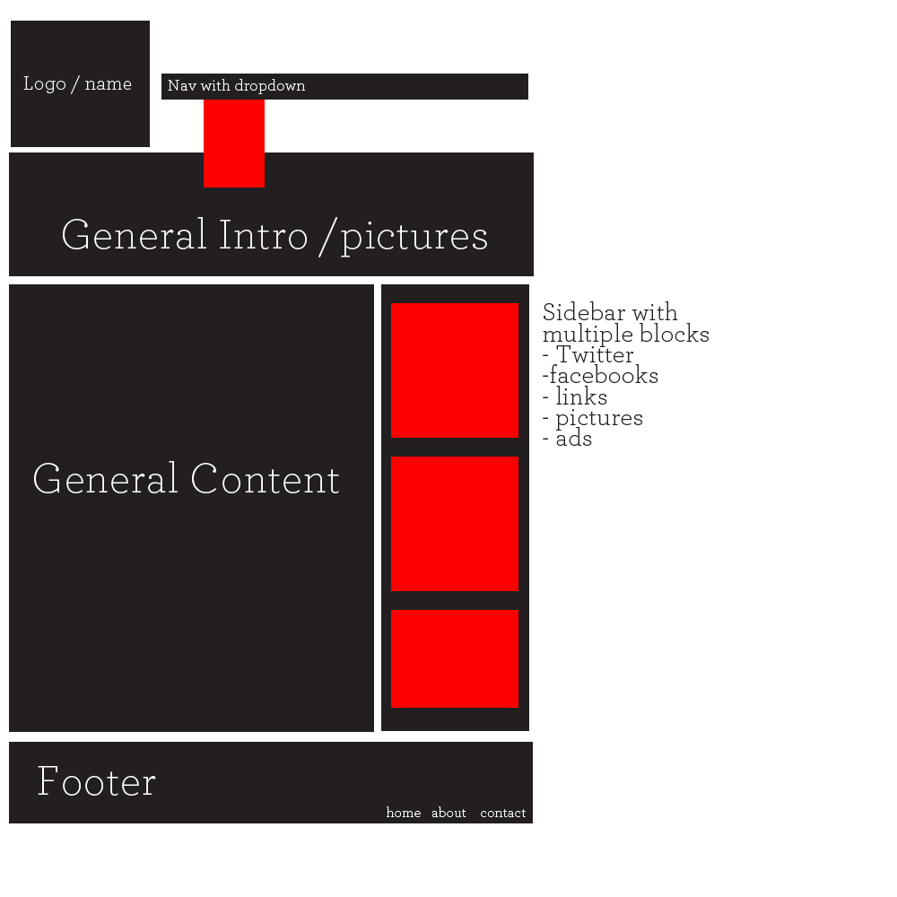

# Week 2 Project - Three Page Website

This project is meant to call upon everything we have done so far. Like our last project, we are going to be creating a website from scratch. This one will be about the same difficulty level as the last one, just with more requirements based on what we have done this week.

You may choose to do your website on anything you wish. Here are some ideas:

* An online resume
* Recreate an existing website. (i.e. the HackerYou website)
* A site for a your own business or a friend's business
* Small site for a local charity

The layout is also 100% up to you, provided you include most/all of the below requirements. If you need some inspiration for the this project's layout, considering crafting the below layout or visiting these websites for ideas:

* [http://www.designfridge.co.uk/](http://www.designfridge.co.uk/)
* [http://cssremix.com/](http://cssremix.com/)
* [http://www.cssmania.com/](http://www.cssmania.com/)

Or you can use one of these designs:
<ul>
	<li>telephasic (<a href="http://html5up.net/uploads/demos/telephasic/left-sidebar.html">preview</a>)</li>
	<li>webworld (<a href="http://w3layouts.com/preview/?l=/webworld-corporate-flat-responsive-web-template">preview</a>)</li>
	<li>organic corporate (<a href="http://w3layouts.com/preview/?l=/organic-corporate-responsive-mobile-website-template">preview</a>)</li>
	<li>golden gate (<a href="http://w3layouts.com/preview/?l=/golden-gate-a-sleek-responsive-mobile-website-template">preview</a>)</li>
	<li>fore (<a href="http://eatapapaya.com/Fore/fore.html">preview</a>)</li>
	<li>socialike (<a href="http://elemisdesign.com/demos/socialike-html/">preview</a>)</li>
	<li>tessellate (<a href="http://html5up.net/tessellate/">preview</a>)</li>
	<li>zeni (<a href="http://luiszuno.com/themes/zeni/">preview</a>)</li>
	<li>goodnatured (<a href="http://www.freecsstemplates.org/preview/goodnatured/">preview</a>)</li>
	<li>untamed (<a href="http://www.freecsstemplates.org/preview/untamed/">preview</a>)</li>
	<li>serendipity (<a href="http://elemisdesign.com/demos/serendipity-html/">preview</a>)</li>
	<li>veridical (<a href="http://www.freecsstemplates.org/preview/veridical/">preview</a>)</li>
	<li>sweetcourse (<a href="http://www.freecsstemplates.org/preview/sweetcourse/">preview</a>)</li>
	<li>strongly typed (<a href="http://html5up.net/uploads/demos/strongly-typed/">preview</a>)</li>
	<li>clearcut (<a href="http://www.freecsstemplates.org/preview/clearcut/">preview</a>)</li>
	<li>two colours (<a href="http://www.freecsstemplates.org/preview/twocolours/">preview</a>)</li>
	<li>justifiable (<a href="http://www.freecsstemplates.org/preview/justifiable/">preview</a>)</li>
	<li>dopetrope (<a href="http://html5up.net/uploads/demos/dopetrope/">preview</a>)</li>
	<li>nina (<a href="http://nina.ries.cz/">preview</a>)</li>
	<li>liquid gem (<a href="http://demo.html5xcss3.com/demo.php?cat=html5themes&amp;host=birondesign&amp;temp=liquidgem">preview</a>)</li>
	<li>deadstocker (<a href="http://www.code-pal.com/deadstocker-fashion-template/">preview</a>)</li>
	<li>legend (<a href="http://www.dzyngiri.com/legend-free-responsive-one-page-template/">preview</a>)</li>
	<li>txt (<a href="http://html5up.net/uploads/demos/txt/">preview</a>)</li>
	<li>escape velocity (<a href="http://html5up.net/uploads/demos/escape-velocity/">preview</a>)</li>
</ul>

Here are some samples from the HackerYou Cohort 1: 

* [Sharon Chan](http://projects.hackeryou.com/week2/sharon-chan)
* [Emma Harris](http://projects.hackeryou.com/week2/emma-harris)
* [Nathan Foon](http://projects.hackeryou.com/week2/nathan-foon)
* [Evelyn Low](http://projects.hackeryou.com/week2/evelyn-low)

## You must have at least the following:

* use percentages for sizing of the main divs - (header, general info, content, sidebar in the example above).
* 3 html pages
* Use external .css files
* box-sizing:border-box;
* CSS Normalize
* floats and the proper use of .clearfix
* 1 Dropdown navigation
* header div
* footer div
* Three divs that hold content (i.e. content and sidebar)
* Two web fonts
* 5 CSS typography styles (text shadow, font size, family, color, transform, etc..)
* box shadow
* relative positioning (maybe bump your sidebar blocks slightly outside the wrapper?)
* absolute positioning (maybe have a twitter bird floating in the sidebar?)
* Embedded media (e.g. Youtube, Maps, Twitter, etc.)
* 1 background image
* 2 links within the page
<!-- * 1 Contact form -->

<!-- Since we spent quite a bit of time on forms, your form should:

* be functional. i.e. use Wufoo.com to receive the data that users submit through the form.
* have custom CSS form styles ([http://www.wufoo.com/2011/05/20/form-anatomy-custom-css/](http://www.wufoo.com/2011/05/20/form-anatomy-custom-css/)) -->

## Bonus points for

* Complex / unique layout
* Multi level dropdown nav
* CSS Gradients
* Use of RGBA() of HSLA()
* Creative use of Borders and border radius
* CSS3 animations (We didn't cover this yet, but do a search)

As always, this will not be graded, but please submit your project for review.