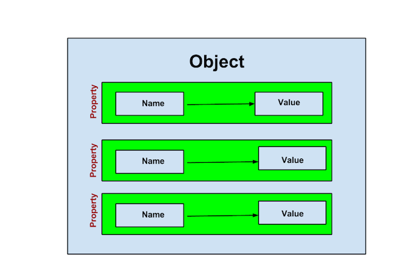

<style> .note {display: none; /* Hide teachers notes */ } .solution {color:white; } .solution:hover {color:black; } </style>

# Objects

The **primitive types** of JavaScript values are *numbers*, *strings*, *boolean values* (true and false), *null* (haven't discussed this yet), and *undefined*. All other values are something called **objects**.

We can think of objects as containers. Inside the container are **properties** , which are referred to as key-value pairs. Each property contains a *name* and *value* which can be referenced directly.



Another way to think about JavaScript objects is to compare them to real-life objects. An apple is an object and it has properties like colour, size, sugar-content, etc.

### Syntax
The syntax for creating an object looks like this:

```
var myObject = {
	propertyOneName: propertyOneValue,
	propertyTwoName: propertyOneValue,
	propertyThreeName: propertyOneValue
}
```

The curly brackets with comma separated properties is the "**object literal**" notation for making objects. There are other ways of making objects which will be covered later.

You may remember a similar layout from your sublime text settings:


**Note**:

* property names are always strings but the quotes are optional if the strings are valid variable names
* the value of an object property can be any of the primitive types (number, string, boolean, null and undefined) or another object (creating a nested tree structure)
* the last property is not followed by a comma.

Here is an example object. Note how objects can be nested inside each other. 

```
var clothing = {
	belt: "can't remember",
	socks: 34,
	shoes: 2,
	pants: 3,
	hat: true,
	tShirts: {
		smallSize: 3,
		mediumSize: 4,
		largeSize: 2
	}
}
```

### Retrieving values
To get a property value from an object you need to know the property name. There are two ways to get the value.

**Dot-Notation**

The generic syntax looks like this:
```
myObject.propertyName;
```

To retrieve the amount of shoes in our clothing object:

```
> clothing.shoes;
2
```

**Bracket-Notation**

The generic syntax looks like this: `myObject["propertyName"];` **Note that the property name is a string with quotes here.**

To retrieve the amount of shoes in our clothing object:

```
> clothing["shoes"];
2
```

Bracket-notation is used if the property names require quotes or if they are unknown at runtime (e.g. user's input is used to retrieve a property).

### Updating Values

To update a property value you just need to know the property name. And again there are two ways to do this.

**Dot-Notation**
Simply assign the value to `myObject.propertyName`, like this:

```
myObject.propertyName = new_value;
```

For example, if we bought some new pants then we can update the value like this:

```
> clothing.pants = 4;
> clothing.pants;
4
```

**Bracket-Notation**

```
myObject["propertyName"] = new_value;
```

The same example using bracket-notation looks like this:

```
> clothing["pants"] = 4;
> clothing["pants"];
4
```

To add a new property to an existing object, simply use those one of the above notations to define a new property and value. This will update your object with the new property and value.

```
> clothing.scarves = 5;
```

**Exercise 1**:

Create an object called "HackerYou" which contains information about the number of courses offered, age of the school, name of instructor, etc. (any information you want to store really…). 

Solution:

<div class="solution">
<pre>
var hackerYou = {
	schoolName: "HackerYou",
	numberOfCourses: 4,
	age: 1,
	nameOfInstructor: "Brenna O'Brien"
}
</pre>
</div>

**Exercise 2**:

Create an object called "student" which has the properties: `id`, `name`, `age`, `GPA`, and `highSchool`. Add some values to the object. Write an expression that retrievesays the following: `"The student Homer Simpson (ID: 1) is 15 years old. He has a GPA of 1.4 and is from Springfield High"`.

Solution: <span class="solution">`"The student " + student["name"] + " " + "(ID: " + student["id"] + ") is " + student["age"] + " years old. He has a GPA of " + student["GPA"] + " and is from " + student["highSchool"] + "."`</span>

## Enumeration
The **for-in loop** can be used to iterate over the properties of an object and execute a block of statements.

The syntax looks like this:

```
for (variable in object) {
  ...
}
```

**Note**: 

* The property name is assigned to the variable on each iteration.
* There is no guarantee that the properties are retrieved in the same order they were inserted -- don't count on the order to stay the same. Browsers will *usually* keep the order the same… *it's just not guaranteed*.

Here's an example:

```
var clothing = {
	socks: 34,
	shoes: 2,
	pants: 3
}

for (item in clothing) {
	console.log("I have " + clothing[item] + " " + item);
}
```

The output looks like this:

```
I have 34 socks
I have 2 shoes
I have 3 pants
```

**Exercises**:

The following object is used in the exercises:

```
var inventory = {
	apples: 2,
	oranges: 3,
	bananas: 6,
	milk: 2
}
```

**Level 1**
Use the inventory object to print a string that looks like this: `"We have 2 apples, 3 oranges, 6 bananas, and 2 milk in stock."`


Solution: <span class="solution">`"We have " + inventory.apples + " apples, " + inventory.oranges + " oranges, " +inventory.bananas + " bananas, and " + inventory.milk + " milk in stock."`</span>

**Level 2**
Iterate over the inventory object and print a list of the items. The output should look like this:

```
apples
oranges
bananas
milk
```

Solution:

<div class="solution">
<pre>
for (item in inventory) {
  var listItem = "There are" + inventory[item] + item;
  console.log(listItem);
}
</pre>
</div>

<!--
**Level 3**
Create an html table from the inventory object. It should look like this:

<table>
  <tr>
    <th>Item</th>
    <th>Quantity</th>
  </tr>

  <tr>
    <td>apples</td>
    <td>2</td>
  </tr>

  <tr>
    <td>oranges</td>
    <td>3</td>
  </tr>

  <tr>
    <td>bananas</td>
    <td>6</td>
  </tr>

  <tr>
    <td>milk</td>
    <td>2</td>
  </tr>
</table>

Solution:


```
var tableHtml = "<table> <tr> <th>Item</th> <th>Quantity</th> </tr>";

for (item in inventory) {
  tableHtml += "<tr> <td>" + item + "</td> <td>" + inventory[item] + "</td></tr>"
}

tableHtml += "</table>";
```
-->