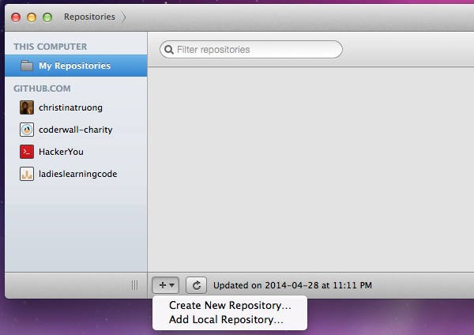
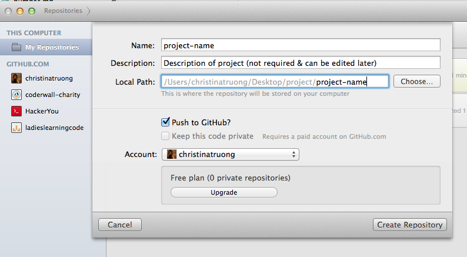
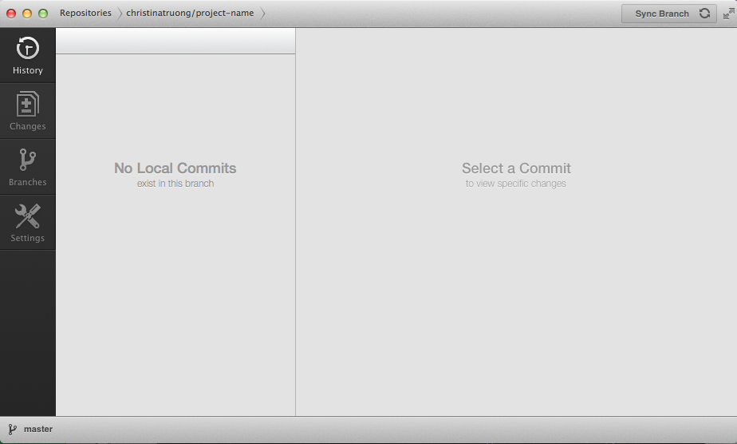
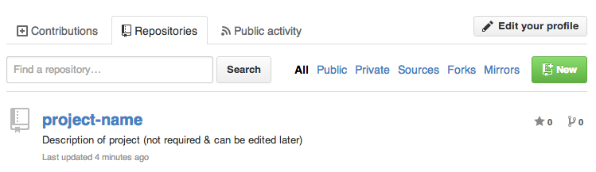
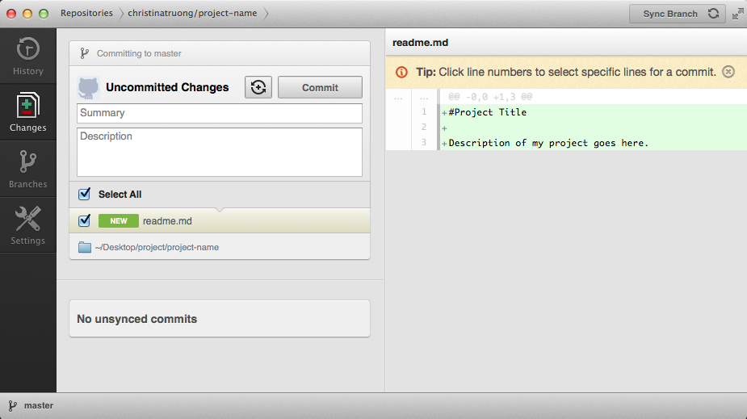
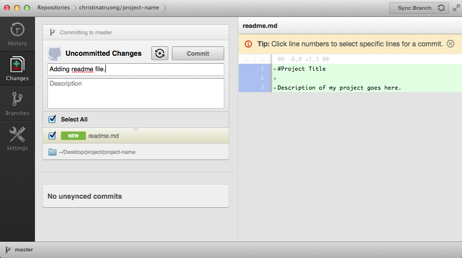
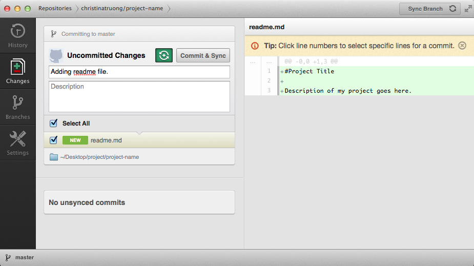

# Git and GitHub

Version control allows us to keep a record of any kind of changes in our directories/files such as updates to the contents of the file as well as adding, removing and renaming files.  It manages changes without overwriting any part of the project.

You may have been in a situation where you've created an "index-version1.html" and "index-version2.html" or something similar in an effort to preserve a "good" copy while experimenting with another copy.  Version control allows us to save different versions of our entire project, compare different versions and revert back to previous versions, if needed.  It's also great for sharing and collaboration.

**Git** is type of version control system. With Git we can:

* take snapshots of our project folder whenever we want (every type of file is saved, it doesn't have to be code)
* "time travel" between snapshots
* easily collaborate with team member's code
* have different people edit the same file at the same time
* easily share our code with others by using services like [GitHub.com](http://github.com)

## Getting Started
To get started, we'll be using [GitHub.com](http://github.com) to host our version-controlled projects. This will bring your projects to the web and allow us to easily share our code and collaborate with others.

There are two ways to access Git: using a GUI (graphical user interface) or via the command line. There are many GUI clients to choose from (of course). Let's trying using GitHub for Mac ([https://mac.github.com/](https://mac.github.com/)) or for Windows ([https://windows.github.com/](https://windows.github.com/)).

We will discuss how to use Git with the command line in another lesson.

### What is a repository?

The purpose of Git is to manage & stores information about the changes in a project/set of files. Git stores this information in a **repository** also referred to as "repo" for short.

After you create a repository, it is stored in the same folder as the project itself, in a subfolder called **.git**. Note that directories that start with a "dot" are usually hidden by default.  So, you may not see this .git directory on your computer but it may show in other places such as your FTP client.

Local folder, **.git** directory hidden:
    

FTP client, **.git** directory (and other dot files) not hidden:

### Creating a new repository

Open your GitHub app and go through the setup and login instructions.  Once you are setup and logged into your account, you will see something like this:

Mac Github app:

On the left, you'll see an option for the repositories on your computer, as well as your GitHub account and any organizations you're a part of. Clicking on a name will show you which repositories are available. 

In the bottom menu, you have the option to create a new repo or add a local repo.  Let's create a new one.  Add a project name (no spaces).  The project description is optional and can be edited later. For your local path, navigate to the directory where you'd like to save your project on your computer.  Check "Push to Github" to add the repo to github.com as well.

Once the repository is created, the app will automatically take you to your new repository (which is currently empty since this is a new repo).

In your github.com account, you will now see your new repo under the **Repositories** tab.

Congratulations, you have now created your first Git repository!

**RECAP:**  
We just created a local project folder on our computer.  We used the Github app to create a *Git repository* and pushed it up to github.com to *host* our repository on the web. Hosting it allows us to be able to share and collaborate with others.

#### Adding new content
Now that we've created a new project repository, we can start adding our project files.

Github recommends adding a README file which contains any kind of information about your project.  You will see readme files using an `.md` extension. This stands for Markdown. Markdown is a text-to-HTML conversion tool. Github has is own variation of [Markdown](https://help.github.com/articles/github-flavored-markdown).

**Exercise:**

1. Create a readme.md file. (While there are specific Markdown editors, we can create one in Sublime.)

	The GitHub app will recognize when a change has occurred in the project folder.

	

2. **Commit** and **push/sync** the changes to the repository.

	**Commit:** This command is telling Git to take a "snapshot" of your repository and creates a checkpoint of the state of your project files. Right now, this is still occurring locally on your computer. You should also include a *commit message* to describe what changes are being added. The description is optional but allows for elaboration of the changes if needed.
	
	**Push:** When you commit only, these changes are still only available to you since they are still housed on your computer. **Push** is the command that pushes these changes up to your github.com repository moving it from your local computer to the web. This is how other people/team members can access any changes made to the repository.  In the Github app, the push command is referred to as **Sync**. 
	
	The app gives you the option to:  
	a) **commit** and **push/sync** in two separate steps
	
	
	
	b) or **commit** and **push/sync** in one step:
	

Any changes, whether it's revisions to existing files or adding/deleting files, need to be committed and pushed to the repository.

###Adding a local repository
In the previous example, we created a brand spanking new repo, then added files to it. However, if you already have a project with existing files, you can also take those existing files and create a new repo to start versioning your files. Remember, there's a second option in the app:

###Cloning a repository
**Cloning** a repo refers to creating a local copy of an existing repository that you may have access to in your github.com account.  

Where do these repositories come from?  Several sources. If you've been added to an organization, you will have access to repos that have been created in the organization's account.  You can also **fork** other public repos and make contributions to them. 

## Learning more

In our next Git lesson, we'll be going over how to use Git in the command line.  If you want to get a sneak peek or get comfortable with some of the terminology, Atlassian has created a great resource for learning Git. Look through it to learn a few tricks that might come in handy:

[https://www.atlassian.com/git/tutorial/git-basics](https://www.atlassian.com/git/tutorial/git-basics)

## The golden rule of source control

**Pro-tip: Commit Early - Commit Often** is a rule that you should go by. Making Git part of your workflow when working on a team is crucial. Even when working alone, versioning will give you piece of mind because you'll always have a backup!  Need more convincing?  Check out some of these articles:

* [What Is Git & Why You Should Use Version Control If You’re a Developer](http://www.makeuseof.com/tag/git-version-control-youre-developer/)
* [GitHub For Beginners: Don't Get Scared, Get Started](http://readwrite.com/2013/09/30/understanding-github-a-journey-for-beginners-part-1#awesm=~oCX648ZyjWDjos)