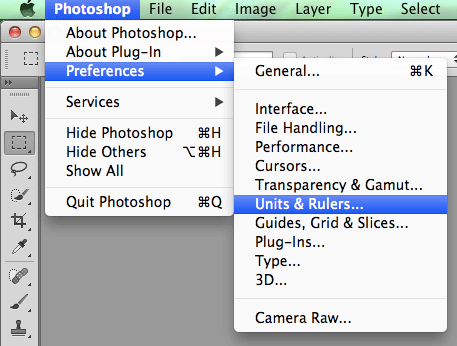
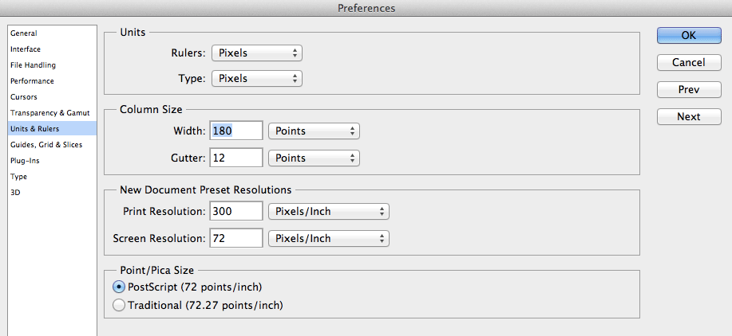
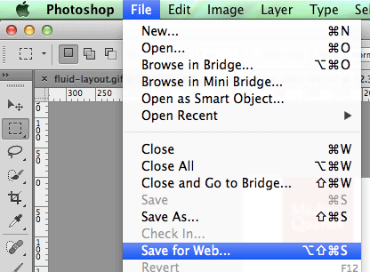
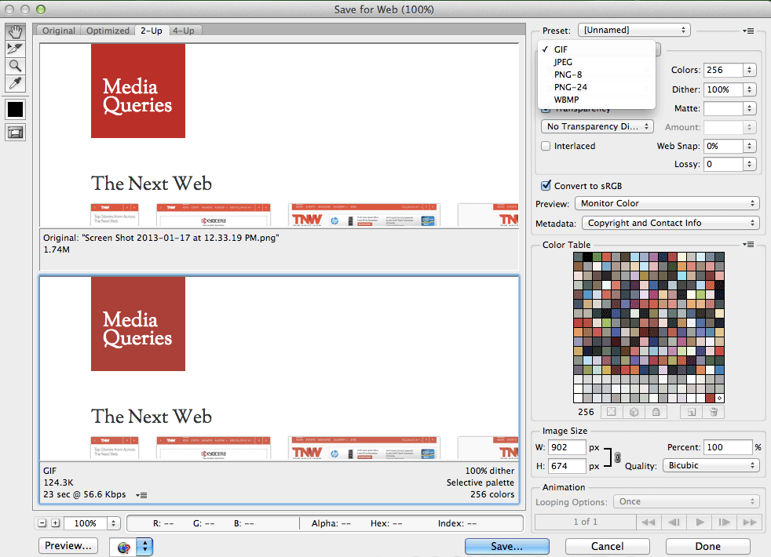

#Working with PSDs

##Setting units
Set your units to pixels in the **Preferences**. It will make your life easier. Promise.

 

##Optimize images for web

Save for web and choose the appropriate image file type.

##Photoshop tools

**For cutting images:**

* Crop tool: [Introducing the New Crop Tool in Photoshop CS6](http://psd.tutsplus.com/tutorials/tools-tips/photoshop-cs6-crop-tool/) (Video)
* Slice tool: Not used that often anymore but here's a resource anyway! [Photoshop CS6: Slice Tool](http://www.youtube.com/watch?v=zOpkh2om1tI) (Video)

**For measuring:**

* Ruler tool: [How to Measure Onscreen in Photoshop CS6](http://www.dummies.com/how-to/content/how-to-measure-onscreen-in-photoshop-cs6.html)
* Rectangular Marquee Tool: [Photoshop CS6: Working with Marquee tools](http://www.youtube.com/watch?v=zCIwIaLhRsw)

###Exercise
Let's download the <a href="examples/hackeryou.psd" class="exercises">HackerYou PSD</a> and practice using some of these tools.
