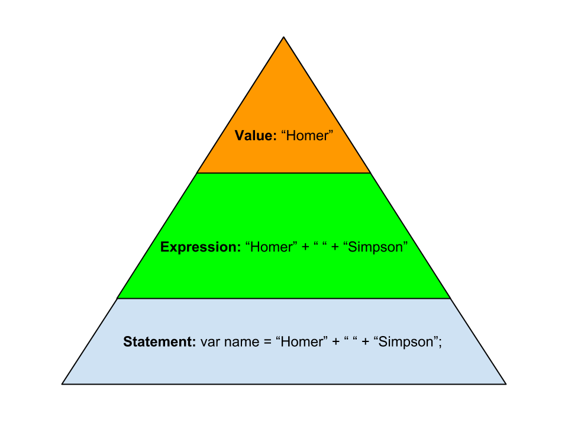

# Week 5, Day 1: Introduction to Programming

> **Teacher Notes:** 

> * Throughout these notes there will be comments labelled as "teacher note". This stuff shouldn't end up in the student notes.
* You'll notice some things are skipped… curriculum is only introduced in context. Resist the urge to discuss things that are yet to come.
* The lessons are intended to be chunked. Not too much lecturing at a time happens. There are exercises and discussions that divide the content. Don't lead the exercises, give students a chance to try them out. They can struggle (it's ok) - you'll be there to discuss the answers after some time.
* Encourage students to do the exercises in pairs.

As you know, computers can perform billions of operations per second. The individual operations are extremely mechanical and simple (e.g., adding two numbers). Computers are incapable of complex operations like a human thought.

The role of a programmer is to think of a solution to a real-world problem and break the solution down into "code" (simple mechanical instructions that the computer can understand). The computer simply runs the series of instructions.

> **Teacher Note:** Discussion: This is a good time to talk a bit about your experience as a programmer. Think of ways to inspire the students to see programming as an empowering profession. Ask students why they want to learn programming.

## JavaScript
Instructions to the computer are given by using a series of 0's and 1's. Fortunately for us, programming languages have been created to allow us to communicate with the computer in a more natural way. JavaScript is one such language.

**Read more about JavaScript** - especially the history, ECMAScript and the uses of JavaScript.

* https://developer.mozilla.org/en-US/docs/Web/JavaScript/A_re-introduction_to_JavaScript (just the Introduction for now)
* https://developer.mozilla.org/en-US/docs/Web/JavaScript/Guide/JavaScript_Overview

> **Teacher Note**: The two resources above can be a bit overwhelming but they contain useful information. Skim through them as a class and distill the essentials. This is an exercise to introduce MDN as a good resource.

## REPL
A REPL (read, eval, print, loop) is an interactive environment where you can type instructions for the computer and the computer will read it, evaluate/run it, print the result and then make itself ready for the next instruction.

A JavaScript REPL is available inside the Google Chrome Web Browser. Open the JavaScript console by going to `View => Developer => JavaScript Console`.

If you see `>` and a blinking cursor… then you're there! Ok, give the computer a simple instruction:

```
> 1 + 1
2
```

> **Teacher Note**: It's likely that students have never used a REPL or the JS console in Chrome. Walk around to make sure that everyone can at least use it as a calculator.

## Expressions and values
The instruction that you gave is called an **expression**. What the computer returns is a **value**. In the example above `1 + 1` is an expression and `2` is a value. Values are simply pieces of data (sequences of 0's and 1's). An expression is any piece of code that resolves to a value.

Vocabulary is very important because it helps us ask coherent questions and adds structure to our thinking.

> **Teacher Note**: Have a discussion. Stress why vocabulary is so important from your personal experiences. Have you asked or answered a question on stack overflow? Was vocabulary important there? Where else? Do students agree?

## Types

### Number
Every value has a type. So far you have seen numbers. All numbers, whether integer or fractional, are of type **Number**. You can do basic arithmetic with numbers.

```
> 55 * 20
> 23.5 - 11
> 6 / 1.5
> 34 + 66.3
```

The symbols (*, -, /, +) are called **operators**. Parentheses can be used to group operations.

**Exercises**
In pairs, solve the following questions by using JavaScript.

> **Teacher note**: Give students 5-10 minutes to work on this. If they finish then get them to explore the console a bit.

- how many hours are in a year? Solution: <span class="solution">365 * 24</span>
- how many minutes are in a decade? Solution: <span class="solution">10 * 365 * 24 * 60</span>
- how many seconds old are you? Solution: <span class="solution">26 * 365 * 24 * 60 * 60</span>

### String
Another type is called **String**. Strings are sequences of characters within quotes, they are used to store text.

```
> "hello"
> "hello there!"
```

**Exercises**

> **Teacher note**: Give students 5-10 minutes to work on this. If they finish then get them to explore the console a bit.

- *String concatenation* is the "addition" of strings. How would you add the three strings "Javascript", "is", "awesome!" to get "JavaScript is awesome!"? Solution: <span class="solution">`"Javascript" + " " + "is" + " " + "awesome!"`</span>
- You can create strings by using either single or double quotes. For example, 'HackerYou' and "HackerYou" are equivalent. What happens when you type in the console:
`'She's a HackerYou student'`. How would you solve this issue?
Solution: <span class="solution">SyntaxError! Escape with \, `'She\'s a HackerYou student'`</span>

- What happens when you type in the console
`'HackerYou' * 6`
`'HackerYou' + 6`
`'HackerYou' * 'Class'`
Solution: <span class="solution">NaN (not a number) for first and third examples. We can't do some operations (like multiplication) with types that are not numbers. Multiplying two strings doesn't make sense anyhow!</span>

There are more types (including **undefined** and **boolean**) but we'll cover them when appropriate.

## Variables
A variable refers to a value. Some analogies:

- a box to hold data
- fishing line: Think of data as fish in the sea, it's hard to keep track of them. Variables are like a fishing line that hook to a value (fish) and let us access it at any point in time.

> **Teacher Note:** Discussion: Can students think of other analogies? Can they predict what variables could be used for?

### Assigning a value to a variable
We can store a piece of data and retrieve it whenever we want with variables. The keyword `var` is used to declare a variable.

```
> var name;
```

We can make a variable refer to a value by using the assignment operator `=`:

```
> name = "Homer";
"Homer"
```
*The value on the right hand side is stored in the variable on the left hand side.*

We can combine the above:

```
> var name = "Homer";
undefined
```

What's that "undefined"? Although it may look like an error, it is not. **Undefined** is a value type that means “I don’t have a value” (pretty meta!). No value is returned because `var name = "Homer"` is not an expression, it's a **statement**. And statements don't always return a value.

Once you have declared a variable with `var` you don't need to keep using the keyword `var`. You can for example reassign a variable to another value without using `var`. It is best practice to declare all of our variables at the top of our code to avoid confusion:

```
> var name;
> name = "Homer";
> "My name is " + name
> name = "Marge";
> "My name is " + name
```

> **Teacher Note:** This is not a good time to get into scopes and why we use var rather than just using expression assignments. It's sufficient to say "An expression always returns/resolves to a value but a statement does not always do that". Adding `var` makes the assignment expression a statement, it's a best practice to use `var` and leave it at that.

**Exercises**:

1. Consider the following code, what value does x refer to in the end?

```
var x = 55;
var y = 10;
x = 12;
```
Solution: <span class="solution">x refers to the value 12.</span>

2. Consider the following code, predict what the result will be:

```
var 8 = x;
```
Solution: <span class="solution">`SyntaxError: Unexpected number`</span>
 

### Using Variables
Reuse this data in another expression by just typing the name of the variable.

```
> var years = 25;
> var days = years * 365;
```

## Syntax
Why did we use semi-colons at the end of the expressions above? Why did the computer complain when we typed `'She's a HackerYou student'`? Just like any other language, there are rules (or grammar) to be followed. Computers need code written in a very specific way or they will not understand it. Syntax errors are very common -- professional programmers make these errors all of the time. Don't be intimidated by these errors; they're easy to fix!

### Semi-colons
Code is composed of **statements** (instructions) that are usually executed one at a time from top to bottom. Each **statement** ends with a semicolon. There are exceptions but we'll explain them when the time comes.



A value is an expression, an expression is a statement, therefore a value is technically a statement.

>**Teacher Note**: Discuss why semicolons are needed (e.g. compiler needs to know when to stop executing a statement). Again stress the difference between values, expressions and statements. Explain the image above.

**Exercise**: Add semicolons and line breaks where appropriate to make the below code work without errors.

```
"I'm just a value!" var schoolName = "HackerYou" var numOfStudents = 25 schoolName + " has " + numOfStudents + " students." 
```

Solution:
<div class="solution">


<pre>
"I'm just a value!";
var schoolName = "HackerYou";
var numOfStudents = 25;
schoolName + " has " + numOfStudents + " students.";
</pre>

</div>

> **Teacher note**: Ask students to point out which part of the above code is a value, expression and statement.

### Whitespace
Whitespace is usually insignificant in JavaScript. There are some situations where whitespace is needed to avoid ambiguity. 

**Exercise**: In the statement `var name = "Homer" ;`, which whitespaces are optional and which are not?

Solution: <span class="solution">a space is needed between `var` and `name` but the other whitespaces are unnecessary. `var name="homer"` will work just fine but `varname="homer"` will create a variable called `varname`… which is not what we wanted.</span>

### Naming Conventions
* Variable names are expected to start with a non-numeric character (letter, _, or $) followed by any character. So `var 23people` is invalid.
* Do not use spaces. Avoid underscores. Use camelCasing. For example, `var myName` is preferred to `var my_name` and `var my name` is invalid.

### Commenting
Comments are not executed so you can use them to puts some notes that will help you remember what your code does. Inline comments can be added with `//`. For example:

```
// There are 365 days in a year
var ageInDays = 26 * 365;
```

Aside: /\*  \*/ are used for multiline and mid-line comments, but avoid using them for now.


### Some common errors:
Have a look at the code below and see if you can spot the error. Then run the code and verify that you spotted an error. Fix the code and verify that it runs properly.

```
> var myName = "Homer";
> myNme;
```

Solution: <span class="solution">`ReferenceError: myNme is not defined`. The variable was simply misspelled but the computer doesn't know that. So it tells you that the misspelled variable doesn't exist. </span>

Now repeat the above steps with the following code:

```
"JavaScript" + " is " + 18 + years old";
```

Solution: <span class="solution">Syntax error. Missing a double-quote. `"JavaScript" + " is " + 18 + "years old";`</span>

We will of course see more errors, get used to it!

## Built-in Functions
So far we can do basic operations but nothing too complicated. Type the following in the console: `prompt("What's your name?");`

`prompt` is a JavaScript **function**. Functions at their most basic level are simply chunks of code that can be run at any point in time.

**Syntax:** `functionName(arguments)`. The parenthesis are required even if the function doesn't have any arguments.

**Terminology:**

- Argument: a value provided to a function
- Pass: to provide arguments to a function
- Call: ask JavaScript to evaluate a function
- Return: pass back a value

In the example above, the *value* "What's your name?" was *passed* as an *argument* to the function named `prompt`. We *called* the function and it *returned* the value that the user typed in.

**Exercises**
There are many built-in functions that you can play with, for example:

* alert()
* console.log()
* Type `Math.` (without hitting enter) and you'll see a list pop up of available math related functions. E.g., Math.cos(), Math.max(), Math.min().

> Teacher note: Students might ask why some of these functions have the prefix "Math" or "console". For now it is sufficient to say that these functions are inside of the Math "box" (object might be too abstract of a idea at the moment).


Go to the [Mozilla Developer Network](https://developer.mozilla.org/en-US/) and use the search box at the top of the page to learn more about these functions.

> **Teacher note**: It's a good idea at this point to model what the students should do in order to research these "functions". Open up the MDN website and search for one of the Math methods. Show the students how to read the Documentation.

**Exercise 1**: Create a program that asks for a person's age in years and then returns their age in seconds.

Solution:
<div class="solution">


<pre>
var age = prompt("What's your age in years?");
age * 365 * 24 * 60 * 60
</pre>

Multiply by 365 to get days, by 24 to get hours, by 60 to get minutes and then 60 again for seconds.

</div>

**Exercise 2**: Create a program that asks for three numbers and then returns the maximum of the three.

Solution:
<div class="solution">


<pre>
var num1 = prompt("First number");
var num2 = prompt("Second number");
var num3 = prompt("Third number");
Math.max(num1, num2, num3);
</pre>

</div>
**Exercise 3**: Create a program of your choosing. Bonus points if you can use everything that we've covered so far.

> **Teacher Note**: Get a few students to share their program with the class. Get them to explain their code by using the vocabulary from this lesson.