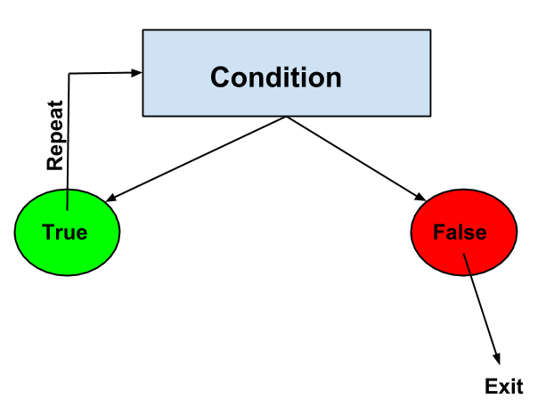

<style> .note {display: none; /* Hide teachers notes */ } .solution {color:white; } .solution:hover {color:black; } </style>

# Control Flow

Normally, instructions or **statements** in a JavaScript are executed one after the other, in the order in which they are written. 

**Control flow** is referring to the order of instructions that are executed based on a decision and is used to change the flow of statements. 

An example of a control flow statement is an if/else statement.

"If this condition is true, do this. Else, do this."

## Booleans

Our code so far is executed top to bottom. If that's all we could do then our programs would be limited. This is where **control flow** comes in. We can write code so that a statement or group of statements is only executed if a logical condition is true or false.

A type of value that we need for conditionals is the **boolean** type. This type has two possible values: `true` or `false`. For example, when checking if two numbers are equal the value returned should be either true or false.

### Comparison operators

Operator     |  Description  
------------ | -------------
==	 | is equal to 
===	 | is exactly equal to (value and type)
!=	| is not equal to
&nbsp; >	| greater than 
&nbsp;<	| less than
&nbsp;>=	| greater than or equal to	
&nbsp;<=	| less than for equal to


Check equality with `===` (equal) and `!==` (not-equal). Note how we **do not use regular equals**. Why?

Check inequality with `>=` `<=` `>` `<` (greater than and less than)

**Exercises**: In the console, write two expressions that return the boolean value `false` and two that return `true`.

Solution:
<div class="solution">

<pre>
> 55 >= 65;
false
> "hello" === "bye";
false
> 2 !== "2";
true
> 2 > 1.5;
true
</pre>

</div>

### Combining boolean expressions

**Logical operators**  
&&	means and  
|| means or  
! means not


We can combine boolean expressions using (&&) and (||) operators.

	true && true // returns true
	true && false // returns false
	false && true // returns false
	false && false // returns false
	true || true // returns true
	false || true // returns true
	true || false // returns true
	false || false // returns false

## Conditional statements
Now that you're familiar with booleans, it's time to meet **conditional statements**. Simply put, these statements allow us to run a statement or group of statements only when a condition is true or false.

Here is the syntax for an if/else statement:

```
if (condition) {
	// block statement (do something)
} else {
	// block statement (do something)
}
```


Let's break that down.

1. `if` is a keyword
2. `condition` is usually a boolean expression
3. `block statement` will be explained below
4. `else` is a keyword. 
5. another `block statement`. Note that the `else` block is optional.


### Block Statements
A block statement is used to group statements (instructions). The block is delimited by a pair of curly brackets `{}`:

```
if ( time === 'morning') {
   // do all of the following things
   console.log("Good morning!");
} else {
	// do all the following things if the first condition is false
	console.log("Good evening!");
}
```

**Exercises**: Complete the following exercises in pairs. Put your code between `<script>` tags inside of an HTML file.

<div class="note">
> **Teacher note**: Suggest to students that they should write the skeleton conditional statement first and then add the condition and statements. That way they are less likely to make syntax errors and it's easier to see which "branch" they are on.
</div>

1. Consider the code below; what is printed to the console?

	```
	var n = 4;
	if (n > 10) {
		console.log("That's a big number");
	} else {
		console.log("It's a small number");
	}
	```

	Solution: <span class="solution">`"It's a small number"` is printed.</span>

2. Create a quizzing program. The program asks a question, the user is prompted to answer, the answer is checked and then a score is printed to the console.

3. Consider the code below; what is printed to the console? What is `else if`?

	```
	var n = 55;
	if (n > 100) {
		console.log("That's a big number");
	} else if (n > 10 ) {
		console.log("It's kinda big");
	} else {
		console.log("It's a small number");
	}
	```

	Solution: <span class="solution">`"It's kinda big"` is printed. `else if` is used to add branches to the conditional statement.</span>

4. Create a simple "rock-paper-scissors" game. Prompt the user to enter their choice of "rock", "paper" or "scissors" and store this value in a variable. Always compare the user's input with the value "rock" (we'll work on making this more dynamic later). If the user's input is "paper" then print to the console "You Win!". If the input is "rock" then print "Tie" and print "You Lose" if the user's input is "scissors". 


## Loops

Another powerful concept in programming is **loops**. With loops, a block of statements are repeatedly executed while a condition is true.



### For Statement

```
for (initialExpression; condition; incrementExpression) {
	// loop statements
}
```

When a **for loop** executes, the following happens:

1. The **initialExpression** is typically used to initialize (start) a counter variable. *This expression can also declare variables with the `var` keyword.* 

2. The **condition** is an expression that is evaluated before each loop iteration. If this expression evaluates to true, the statement is executed. If this expression evaluates to false, the `for loop` ends.

3. The **incrementExpression** is evaluated at the end of each loop iteration. Generally used to update or increment the counter variable.

Let's look at an example:

<div class="note">
> **Teacher note**: Ask students to predict what would happen if we ran the code below. Ask students to explain their answer before seeing the code in action.
</div>

Before running the code below predict what would happen. 

```
for (var i = 0; i < 10; i = i + 1) {
	console.log(i);
}
```

When would you want to use this? Let's say you have a music playlist containing 10 songs. You want the songs to auto play the next song until you get to the end of the playlist. The for loop may look something like this:

	for (var i = 0; i < 10; i = i + 1) {
		playNextSong(i);
	}

`var i = 0;` Start at the first song.   
`i < 10` If the current song that is playing is less than 10, you are not at the end of the list yet, so play the next song.    
`i + 1` To move to the next song on the list, add 1 to the current index number to move onto the next song.

**Exercises**:
Complete the following exercises in pairs.

<div class="note">
> **Teacher note**: It might be a good idea at this point to explain how pair programming works, its benefits, who uses it etc. 
</div>

**Level 1** Log into the console the numbers between 5 and 12.

**Level 2**. Log into the console the numbers between 1 and 10 in reverse (i.e. starting with 10). The output should look something like this:

```
10
9
8
7
6
5
4
3
2
1
```

Solution:
<div class="solution">
<pre>
for(var i = 10; i > 0; i--){
  console.log(i);
}
</pre>
</div>

**Level 2**. Print the even numbers between 1 and 20. The output should look something like this:

```
2
4
6
8
10
12
14
16
18
20
```

Hint: Look up the modulo operator and use an if statement.

Solution:
<div class="solution">
<pre>
for(var i = 1; i <= 20; i++){
  if(i % 2 === 0){
    console.log(i);
  }
}
</pre>
</div>

**Level 3**. Print the numbers from 1 to 100. But for multiples of 3 print “Fizz” instead of the number and for the multiples of five print “Buzz”. For numbers which are multiple of both 3 and 5, print “FizzBuzz”. The output should look something like this:

```
1
2
Fizz
4
Buzz
Fizz
7
8
Fizz
Buzz
11
Fizz
13
14
FizzBuzz
...
```

Hints: Look up combining boolean expressions with &&. Also look up modulo.

Solution:
<div class="solution">
<pre>
for(var i = 1; i < 100; i++){
  if(i%3 === 0 && i%5 === 0){
    console.log("FizzBuzz");
  }
  else if(i%3 === 0) {
    console.log("Fizz");
  }
  else if(i%5 === 0){
    console.log("Buzz");
  }
  else {
    console.log(i);
  }
}
</pre>
</div>

### While Statement

```
while (condition) {
   // loop statements
}
```

A while loop is much simpler. The block executes repeatedly as long as the condition is true.

**DANGER!!** If the condition is never false then the while loop will keep going and your browser will crash. This is called an **infinite loop**. If you do get an infinite loop then go to "Window => Task Manager" in the browser, select the Task that is using a lot of CPU and click "End Process".

Let's look at an example:

```
var i = 0;
while (i < 10) {
	console.log(i);
	i = i + 1;
}
```

When `i === 9` the block executes one final time, 9 is printed and `i` is incremented to 10. The block doesn't execute anymore because the condition is false BUT the value from the last executed expression is returned (that's why `10` has a little arrow beside it). To test this, try this code:

```
var i = 0;
while (i < 10) {
	console.log(i);
	i = i + 1;
	"this value is returned!";
}
```

<div class="note">
> **Teacher note**: This is a good time to stress the difference between printed values (to the console and to the window) and returned values. 
</div>

### Break Statement
We can terminate a loop at any time by using the break statement. For example:

```
var number = 23;
while (true) {
	number = number + 1
  if (number % 9 == 0) {
    break;
  }
}
```

The above example would be an infinite loop (because true is always true!) but the break statement terminates the loop when the number is divisible by 9. The returned value (27) is greater than 23 and divisible by 9.

**Exercises**:
Complete the for-loop exercises but this time by using a while-loop. Work in pairs.