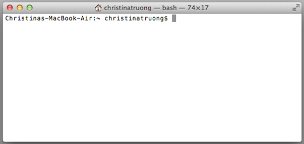
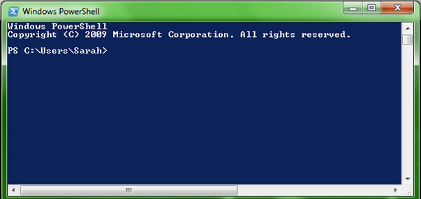

# Intro to Command Line

The command line (**Terminal** in Mac, **Powershell** in PC) is a tool that allows us to interact *directly* with the operating system. The Operating System's *user interface* is pretty much just a visual layer on top of the command line. We can run tasks that the UI does through the command line (i.e. open files, edit files, delete files, run programs). 

Nearly all software programs have a graphical user interface, or GUI. This means the program includes graphical controls, which the user can select using a mouse or keyboard. A typical GUI of a software program includes a menu bar, toolbar, windows, buttons, and other controls. 


## Why should a front-end developer learn to use the command line?

* Tools like Git often rely on being comfortable with the command line (even when GUIs are available to use).
* Production servers (i.e. your web host) don't have a user interface so knowing how to use the command line will be handy.
* Many tools that speed up development rely on the command line (e.g. Grunt, Sass/Less).
* You'll feel like a hacker and that's super awesome.


## Opening the command line

For Mac users, open the application called **Terminal**:

* Applications -> Utilities -> Terminal (or search for it in Spotlight)
   
For Windows, open the application called **Powershell**:

* Start -> Search programs and files -> type "powershell" and hit enter

**A great alternative for Windows computers is [http://bliker.github.io/cmder/](http://bliker.github.io/cmder/). This app will provide us with more abilities system wide when we move into other programs and toolsets.**

What you should see is a relatively blank window. Terminal (Mac) has a white background and the Powershell (Windows) has a blue/black background, by default.

**Terminal (Mac)**  



**Powershell (Windows)**



### The prompt

Think of the command line as a direct interface to your computer. You give it one instruction, it **R**eads it, **E**xecutes it, **P**rints a response (when appropriate) and then returns/**L**oops (ready to do the next task). This behaviour is called REPL (Read, Evaluate/Execute, Print, Loop) and you will see it again when we get into programming.

The **prompt** is where you will write your commands/instructions. 

In Terminal you will see:

	Computer-Name:~ Your-Username$ 
	
In Powershell you'll see:

	PS C:\Users\Your-Username>
	
Note the `>` in Powershell or `$` in Terminal at the end. This is referred to as the **prompt** and since it always appears, you don't actually type the `>` or `$` symbol.


## Command Line Tools

The command line gives us access to many small tools that can be used to perform tasks. While there are many tools, today we'll look at a few basic commands that will get us up and running.

### Print working directory (pwd)

The print working directory command (pwd) a.k.a "where are we?" shows which directory you are currently in. Remember, the `$` and `>` are only referring to the the prompt. Don't actually type it, just type the command and enter.  

The output will appear immediately after you enter, followed by another prompt.

**Terminal `$ pwd`**

	Computer-Name:~ yourusername$ pwd
	/Users/yourusername
	Computer-Name:~ yourusername$

**Powershell `> pwd`**

	PS C:\Users\yourusername> pwd
	Path
	----
	C:\Users\yourusername
	PS C:\Users\yourusername>
	

### List Directory (ls) / Change Directory (cd)
The `ls` command will list all the directories inside of your current directory. To move around between directories (folders) use `cd` to change to a specific directory. 

Let's first list our directories, then change to our Desktop.

	$ ls
	list of all directories will appear here
	
	$ cd Desktop
	Computer-Name:Desktop yourusername$
	
Note how "Desktop" gets added to the output. That shows that you've changed to that directory. You can even type `$ pwd` to double check for good measure!

#### Moving between many levels of directories
If you want to go to directory within a directory, use `/` followed by the subdirectory name to go into it.

	$ cd Desktop/projects-folder/project-one

What does the above command mean?

To go back up a folder, use `..` with the `cd` command.
	
	$ cd ..


`~ ` changes to the home directory (back to where you started when you first opened Terminal/Powershell), even if you're many directory levels deep.

	$ cd ~ 

After you've started to type a directory name, you can also press the tab key and command line will finish it for you.  If there are more than one directory that starts with the same characters it will list all matching directory names.

Typed "D" then tabbed

	$ cd D  
	
Result:

	Desktop/   Documents/   Downloads/   Dropbox/   
	Christinas-MacBook-Air:~ christinatruong$ cd D


### Make a directory (mkdir)

`mkdir` is the command for making a new directory. The *argument* that follows this command is the name that you want to give the directory (folder).

	$ mkdir new-folder-name

Note, you should make sure you are in the directory where you want to create this folder first before making a new directory, though you can move the folder afterwards through the command line or through your OS interface.


### Manual

The command line also includes a handy manual tool. `man` gives us information about all of the different commands. 

Type `$ man` and whichever command you'd like to get more information on.

Show info about the `ls` command:
	
	$ man ls
	

> You will see a colon at the bottom of the screen and you will not be able to type anything. Don't panic! This means you are in a command line program that extends beyond the view/window.
> 
>To see more press the **Enter** key. To exit press the **q** key.

**Exercise 1**:
Use the man pages to explore the following command-line tools: `ls`, `cp`, `mv`, `rm`, `rmdir`, `touch`, `cat`.

Want to know more? Check out [The Command Line Crash Course](http://cli.learncodethehardway.org/book/).

## Command Line and Git

Download and install [the latest version of Git](http://git-scm.com/downloads).

## Configure Git

When Git takes snapshots of your code it can associate them with your name and email address. This is useful when collaborating and sharing your work. Once you have git installed, open up the command line and type the following commands:

```
$ git config --global user.name "Your Actual Name"
$ git config --global user.email "Your Actual Email"
```

Confirm that everything is working by typing:

```
$ git config --get user.name
$ git config --get user.email
```

It should print the name and email address that you set.

## Create a repository
Before we start adding and pushing changes to a repository, we first need a repository to push to. When we used the GitHub GUI, we were able to create it from the program.  Though it is possible to [create a GitHub repo via the command line by accessing their API](https://developer.github.com/v3/repos/#create), it's much more straightforward to just do it from the website itself.  

1. Create or login into [github.com](http://github.com).
2. Follow the instructions for creating a repository here: [https://help.github.com/articles/create-a-repo](https://help.github.com/articles/create-a-repo) but skip the "Create a README for your repository" section.
3. From the command line navigate to your local repository (hint: use `$ cd`)
4. Add the Github repository as a **remote** using the following command:

```
$ git remote add origin https://github.com/<yourusername>/<your-repo-name>.git
```
This step basically "connects" your local copy on your computer to the repository hosted on github.com. This will allow you to push your changes from your computer up into the repo.


## Initialize a Git Repository
Now that the repository is all set up, we're ready to *git* started (heh heh).

From the command line, run `$ git init` to turn any directory into a Git repository. (You should still be in your project directory from the previous step) 

The directory will not visibly change in any way. The `$ git init` command actually creates a hidden folder called **.git** inside of the directory.

## Git workflow
When using Git, whether through a GUI or command line, there is a specific workflow that is required. Let's go over the process and some terminology.

#### Working directory
The **working directory** is the folder that contains all your project files.  This is where you make your changes to code, add any files and removing files are also considered changes that will need to be included in the versioning process.

#### Staging area / adding updated files
The **staging area** is where you collect updated files/folders to eventually be saved as a "snapshot" or version of your project files up to the point.  Only the files that have been changed need to be staged.

In the Github GUI, when any files are changed, it shows up in the **Changes** tab but nothing happens to them until you **commit** them.

When using the command line, changes need to be *added* to the staging area. You can do so with the `$ git add <file>` command. There are several different ways to add files (surprise surprise).

Add/stage a specific file: `$ git add file-name`  
Add/stage all new, modified and deleted files: `$git add -A`  
Add/stage new and modified, without deleted: `$git add .`  
Add/stages modified and deleted, without new: `$git add -u`

#### Commit your changes
**Commit** your changes and updates to take the snapshot of your project.  Every commit should contain a short message to summarize the changes being committed. (`-m` stands for message)

	$ git commit -m "a useful commit message here"

For your first commit, it's common for your message to be "initial commit".

#### Git Status

To see which files are in the working directory and which are in the staging area or just to what's going on in general, use `$ git status`.  You can use this command at any step to check the status.

#### Git push

Note that all these steps are still happening *locally* on your computer.  Your repository that is hosted online via github.com has not changed yet. We need to **push** the code to get it go up into the repository.

	$ git push origin master

You should now see your changes on github.com.


**Git workflow**:

1. Work (code, make changes, add/remove files, etc.)
2. Add files to staging area when you're done a chunk of work. (`$ git add <file>`)
3. Take a snapshot (`$ git commit -m "a useful commit message here"`)
4. `$ git push` to update github.com repository.
5. Repeat steps 1-4.

### Exercise

* Navigate to one of your project folders and make it a Git repository. 
* Add all of the files into the staging area.
* Take a snapshot by committing with the message "initial commit".

**Pro-tip: Commit Early - Commit Often**

It's tempting to wait until you're "done" to make a commit but it's better to commit early and often.  Commit every time you've completed a small chunk of code, milestone or feature. The more often you commit, the more "snapshots" and backup copies you'll have to roll back to if you've really messed up your code!  

When you are actively working on a project, try to commit at **least** at the end of the day (though it'll probably be more likely that you'll commit several times a day).  Even if you're not done a feature, your commit message could just be "saving work".  

**Bonus:** [Git cheatsheet](https://help.github.com/articles/git-cheatsheet)!