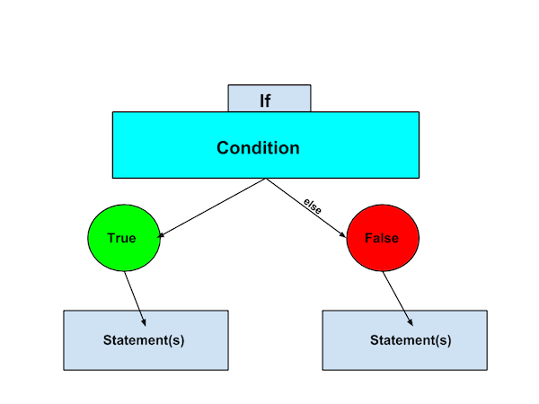

# Week 5, Day 1: Control Flow

You have written a few programs -- congratulations! It's time to learn a very powerful programming concept but the console is an awkward place to write a lot of code. We need a more convenient way of writing Javascript.

> Teacher note: Discussion: have any of the students programmed before? What is a better environment for writing code (the answer should be a code editor). Why (can save code, easier to copy/paste, easier to write multi-line code)? Where can we put the JS code (answer script tags or .js files)?

JavaScript can be included inside of HTML files in two ways:

* Linking to a JavaScript file (.js extension): `<script type="text/javascript"
    src="app.js"></script>`
* Using `<script></script>` tags like so: `<script> // JavaScript code in here </script>`


## Boolean

Our code so far is executed top to bottom. If that's all we could do then our programs would be limited. This is where **control flow** comes in. We can write code so that a statement or group of statements is only executed if a logical condition is true (or false).

> Teacher note: Discussion: What is a logical condition anyhow? Can students think of examples that are unrelated to programming? For example => "If hungry then eat.".

A type of value that we need for conditionals is the **boolean** type. This type has two possible values: `true` or `false`. **Boolean expressions** produce boolean values. For example, when checking if two numbers are equal the value returned should be either true or false.

### Comparison operators

* Check equality with `===` (equal) and `!==` (not-equal)
* Check inequality with `>=` `<=` `>` `<` (greater than and less than)

**Exercises**: Write two expressions that return the boolean value `false` and two that return `true`.

Solution:
<div class="solution">

<pre>
> 55 >= 65;
false
> "hello" === "bye";
false
> 2 !== "2";
true
> 2 > 1.5;
true
</pre>

</div>


## Conditional statements
Now that you're familiar with booleans, it's time to meet **conditional statements**. Simply put, these statements allow us to run a statement or group of statements only when a condition is true (or false).

This is what they look like:

```
if (condition) {
	// block statement
} else {
	// block statement
}
```

> **Teacher note**: Read this code to give students the idea that it reads very much like a natural language. "If condition is true then do the following, otherwise do this."

Let's break that down.

1. `if` is a keyword
2. `condition` is usually a boolean expression
3. `block statement` will be explained below
4. `else` is a keyword. a synonym in english would be "otherwise". 
5. another `block statement`. Note that the `else` block is optional.

> **Teacher note**: Have students draw a diagram to represent the conditional statement. It should look something like this: 



### Block Statements
A block statement is used to group statements. The block is delimited by a pair of curly brackets:

```
{
   statement_1;
   statement_2;
   .
   .
   .
   statement_n;
}
```

**Exercises**: Complete the following exercises in pairs. Put your code between `<script>` tags inside of an HTML file.

> **Teacher note**: Suggest to students that they should write the skeleton conditional statement first and then add the condition and statements. That way they are less likely to make syntax errors and it's easier to see which "branch" they are on.

1. Consider the code below; what is printed to the console?

```
var n = 4;
if (n > 10) {
	console.log("That's a big number");
} else {
	console.log("It's a small number");
}
```

Solution: <span class="solution">`"It's a small number"` is printed.</span>

2. Create a quizzing program. The program asks a question, the user is prompted to answer, the answer is checked and then a score is printed to the console.

3. Consider the code below; what is printed to the console? What is `else if`?

```
var n = 55;
if (n > 100) {
	console.log("That's a big number");
} else if (n > 10 ) {
	console.log("It's kinda big");
} else {
	console.log("It's a small number");
}
```

Solution: <span class="solution">`"It's kinda big"` is printed. `else if` is used to add branches to the conditional statement.</span>

4. Create a simple "rock-paper-scissors" game. Prompt the user to enter their choice of "rock", "paper" or "scissors" and store this value in a variable. Always compare the user's input with the value "rock" (we'll work on making this more dynamic later). If the user's input is "paper" then print to the console "You Win!". If the input is "rock" then print "Tie" and print "You Lose" if the user's input is "scissors". 


## Loops

Another powerful concept in programming is "loops". With loops, a block of statements is repeatedly executed while a condition is true.


### For Statement

```
for (initialExpression; condition; incrementExpression) {
	// loop statements
}
```

When a **for loop** executes, the following happens:

1. The `initialExpression` is executed. This expression usually initializes one or more loop counters. *This expression can also declare variables.*
2. The `condition` expression is evaluated. If the value of condition is `true`, the `loop statements` execute. If the value of condition is `false`, the for loop terminates.
3. The `incrementExpression` executes and control returns to step 2.

Let's look at an example:

> **Teacher note**: Ask students to predict what would happen if we ran the code below. Ask students to explain their answer before seeing the code in action.

Before running the code below predict what would happen. 

```
for (var i = 0; i < 10; i = i + 1) {
	console.log(i);
}
```

**Exercises**:
Complete the following exercises in pairs.

> **Teacher note**: It might be a good idea at this point to explain how pair programming works, its benefits, who uses it etc. 

**Level 1**. Print the numbers between 1 and 10 in reverse (i.e. starting with 10). The output should look something like this:

```
10
9
8
7
6
5
4
3
2
1
```

Solution:
<div class="solution">
<pre>
for(var i = 10; i > 0; i--){
  console.log(i);
}
<pre>
</div>

**Level 2**. Print the even numbers between 1 and 20. The output should look something like this:

```
2
4
6
8
10
12
14
16
18
20
```

Hint: Look up modulo.

Solution:
<div class="solution">
<pre>
for(var i = 1; i <= 20; i++){
  if(i % 2 === 0){
    console.log(i);
  }
}
</pre>
</div>

**Level 3**. Print the numbers from 1 to 100. But for multiples of 3 print “Fizz” instead of the number and for the multiples of five print “Buzz”. For numbers which are multiple of both 3 and 5, print “FizzBuzz”. The output should look something like this:

```
1
2
Fizz
4
Buzz
Fizz
7
8
Fizz
Buzz
11
Fizz
13
14
FizzBuzz
...
```

Hints: Look up combining boolean expressions with &&. Also look up modulo.

Solution:
<div class="solution">
<pre>
for(var i = 1; i < 100; i++){
  if(i%3 === 0 && i%5 === 0){
    console.log("FizzBuzz");
  }
  else if(i%3 === 0) {
    console.log("Fizz");
  }
  else if(i%5 === 0){
    console.log("Buzz");
  }
  else {
    console.log(i);
  }
}
<pre>
</div>

### While Statement

```
while (condition) {
   // loop statements
}
```

A while loop is much simpler. The block executes repeatedly as long as the condition is true.

**DANGER!!** If the condition is never false then the while loop will keep going and your browser will crash. This is called an **infinite loop**. If you do get an infinite loop then go to "Window => Task Manager" in the browser, select the Task that is using a lot of CPU and click "End Process".

Let's look at an example:

```
var i = 0;
while (i < 10) {
	console.log(i);
	i = i + 1;
}
```

When `i === 9` the block executes one final time, 9 is printed and `i` is incremented to 10. The block doesn't execute anymore because the condition is false BUT the value from the last executed expression is returned (that's why `10` has a little arrow beside it). To test this, try this code:

```
var i = 0;
while (i < 10) {
	console.log(i);
	i = i + 1;
	"this value is returned!";
}
```

> **Teacher note**: This is a good time to stress the difference between printed values (to the console and to the window) and returned values. 

### Break Statement
We can terminate a loop at any time by using the break statement. For example:

```
var number = 23;
while (true) {
	number = number + 1
  if (number % 9 == 0) {
    break;
  }
}
```

The above example would be an infinite loop (because true is always true!) but the break statement terminates the loop when the number is divisible by 9. The returned value (27) is greater than 23 and divisible by 9.

### Syntax

Don't use semicolons after the if, for, and while statements.

**Exercises**:
Complete the for-loop exercises but this time by using a while-loop. Work in pairs.