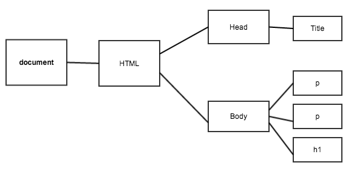

# Week 5, Day 3 jQuery

We have covered most of what you need to know of the JavaScript language. We will now see that variables, values, expressions, statements, objects and functions can be combined to do some amazing things on the web.

## Quick Review:

**String**
	
	var myString = "Hello There";

**Number**

	var myNumber = 10;

**Array**
	
	var myArray = ["Wes","Brenna",54];

**Object**
	
	var myObject = {
		name : "Wes",
		age : 47 // jokes
	}

**Function**
	
	var findSquareRoot = function(width,height) {
		return width * height;
	}

**Boolean**
	
	var myBoolean = true; // true
	var myBoolean = 1; // true
	var myBoolean = false; // false
	var myBoolean = 0; // false


**Operators**

`>` - Greater than
`<` - Less than
`>=` Greater or equal
`<=` Less or equal

`!` - Opposite

`!true` // false


## The DOM
We need a way to programatically work with HTML and the browser allows us to do this through the **DOM**. 

DOM stands for **document object model**. The HTML document is represented as a tree with each element being a node on the tree. 

With JavaScript we can access any element/node and modify it however we want. With JavaScript, we can:

- Add or remove a class which can trigger CSS3 transitions
- Update the text in any element
- hide / show elements

Have a look at the following HTML document:

```
<!DOCTYPE html>
<html>
<head>
  <title>I'm a page!</title>
</head>
<body>
  <h1>A header with valuable information</h1>

  <p>Lorem ipsum dolor sit amet, consectetur adipisicing elit….</p>

  <p>Suscipit, maiores, commodi, sunt et laborum reiciendis est aliquam ….</p>
</body>
</html>
```

The DOM for the HTML document above can be visualized like this:



Each node can be accessed with JavaScript and converted into a JavaScript `Object`. In the chrome JavaScript console type `document` to get access to an `object` that represents the current HTML document. This object has many properties and many methods that the browser defines.

### Exploring the DOM

The Mozilla developer network has [documentation](https://developer.mozilla.org/en-US/docs/Web/API/Document) with information about all of the properties and methods of the `document` object. The methods of importance for now are `getElementById()`, `getElementsByTagName()` and `getElementsByClassName()`.

**Exercises**:

Open up hackeryou.com and use the console to programatically explore the page.

* get the element with id of "mainHead"
* get the elements with the class of "sidebar".
* get all anchor elements on the page.

**Hint**: Don't forget to call your objects on the document object.


**Solutions**:

* `document.getElementById("mainHead");`
* `document.getElementsByClassName("sidebar");`
* `document.getElementsByTagName("a");`

The methods above return a DOM object representing the element. If more than one element is found (in the case of class name or tag name for example) then an array of objects is returned.

### Manipulating the DOM

The Mozilla developer network has [documentation](https://developer.mozilla.org/en-US/docs/Web/API/element) with information about all of the properties and methods of the element objects. We can for example get/set the `id` and `class` attributes of an element. We can get/set the HTML that makes up the element with `element.outerHTML`. Note that outerHTML is a property. 

**Exercises**:

* get the element with id of "mainHead" and change the HTML to a simple paragraph containing the text 'Hello World!'. 
* get the elements with the class "overlay" and add a class of "box" 

**Solutions**:

* `document.getElementById("mainHead").outerHTML = "<p> 'Hello World!' </p>";`
* `document.getElementsByClassName("overlay")[0].className = "overlay box";`


## jQuery

Working with the DOM can be tedious because:

* the API (methods & properties) for manipulating the DOM can be limiting
* the API requires quite a bit of coding
* different browsers implement the API differently.


jQuery is the solution to poor cross-browser APIs. jQuery is a JavaScript Library that makes doing things with the DOM much, much easier. Without it, your JavaScript would be much harder to write and your code would be much longer. 

**jQuery is JavaScript**. When you write jQuery, you are writing javascript, you can and will still use all the existing things you learned about numbers/strings/arrays/objects and if statements.

## Tutorial: manipulating the DOM with jQuery

### Load jQuery
- Open `try-jquery.html` in sublime text.
- We need to load the jQuery library before we can work with it. A simple way to do this is to use a remote copy via a CDN. Scroll to the bottom of the main page of jquery.com to find the "Quick Access" URL to jQuery which is served by google. Include this URL in script tags in your HTML file. 

- Aside: CDN stands for "content delivery network". A CDN is a network of computers which provides static resources (images, javascript, css, etc.) to users based on proximity. The resources are hosted in multiple locations and the closest computer to the user will serve the resource. CDNs are fast.

Solution: `<script src="http://ajax.googleapis.com/ajax/libs/jquery/1.10.2/jquery.min.js"></script>`.

### Test that jQuery is loaded
- Open `try-jquery.html` in Chrome. We can test that jQuery has been successfully loaded by going to the JavaScript console. The console should show no errors. Type `jQuery` into the console and press enter. The return value should be `function (e,t){return new x.fn.init(e,t,r)}`. This is telling you that **jQuery is a function**. Type `$` and press enter, you should get the same return value. `$` **is an alias for jQuery**, meaning both will do the same thing, $ is just easier. 

### Selecting elements
jQuery is a function that is defined with multiple parameters, but they are optional. The `selector` parameter is all we need for the time being. To find an element on the page we call the jQuery function and pass it a selector that corresponds to the element.

`$(selector);` or `jQuery(selector);`

#### jQuery Selectors 
jQuery selectors are exactly the same as CSS selectors! So just like CSS we select elements by using classes, and tag names. All of your existing 20+ types of selectors will totally work in jQuery.

So to find the `h1` element we type `$("h1");` in the console. The returned is an array with the h1 tag in it.


If we select something where there is more than 1, like span tags:

	$('span')

We will get an array back of multiple items:


 
### jQuery objects

When we got the above `h1` tag back. It isn't just the plain ol' h1 tag, its actually something called a **jQuery Object** which has a number of **methods** on it. (Remember that methods are just functions that are on an object).

jQuery objects are representations of the HTML elements and they have tons of methods. We'll explore some of these methods together and then we'll show you how to effectively use the jQuery documentation to learn more. 

* Let's use jQuery to change the text of the h1 tag. First get the h1 jQuery object with `$("h1")` and then use the `text()` method to set the text. `$("h1").text("New h1 text!");` should do the trick.


* Lets move an element to a different location. The two paragraphs have the class names `firstp` and `secondp` respectively. jQuery objects have a method called `insertAfter()` which takes an element and moves it after another element. `$(".firstp").insertAfter(".secondp");` will do the trick.

* The CSS class `highlight` is already defined. We can add this class to an element with the `addClass()` method. Add the highlight class to the h1 tag. Solution: `$("h1").addClass("highlight");`

* We can remove this class from an element with the `removeClass()` method. Remove the highlight class to the h1 tag. Solution: `$("h1").removeClass("highlight");`. The `toggleClass()` method will toggle the class on and off! 


## Tutorial: jQuery events

<!-- 
### Aside: Functions as first-class objects

Let's take a quick detour to the "Functions as first-class objects" notes. If we master functions then jQuery events will be really easy to work with. 
 -->
 
### Events

With jQuery we can do anything we want in response to an **event**.  In the browser events usually consist of mouse clicks, mouse hovers, scrolling, window resizes, keyboard presses, etc. The process looks like this:

1. **Event Binding**: attach an event **listener** to a jQuery object with the `on()` method.
2. **Specify the event**: the first argument to the `on()` method is a string (e.g. `"click"`).
3. **Provide Callback Function**: the second argument is an anonymous function with some code that will run once the event happens.

The generic code looks like this:

```
$(selector).on(event, function(){
	// run this code when event happens
});
```

Open `jQuery-events.html` in sublime text. jQuery has already been loaded for you. We will be writing JavaScript inside of this HTML file so we will run into an issue that we didn't see when working in the console. While in the console all of the code that we wrote was executed after the page was fully loaded. The JavaScript that we will be writing will be loading within the HTML document so there is a chance that it will execute before the page is fully loaded.

If we try to find an element using jQuery before it's loaded, we will get an error. To prevent this from happening we use a jQuery method that will let us know when the document is ready to be manipulated.

Inside the `<script></script>` tags add the following:

```
$(document).ready(function(){
	// your code here
});
```

So what we are doing is wrapping all of our code inside of an anonymous function. This function will be called once the document is ready.

There are four boxes on the page. We want to hide the boxes when they are clicked. Let's start with the skeleton code for an event.

```
$(document).ready(function(){
	$(selector).on(event, function(){
		// run this code when event happens
	});
});
```

All of the boxes have the class "box" so we can use that to select them; `$(".box")` should do the trick. 

```
$(document).ready(function(){
	$(".box").on(event, function(){
		// run this code when event happens
	});
});
```

The even we're looking for is a click:

```
$(document).ready(function(){
	$(".box").on("click", function(){
		// run this code when event happens
	});
});
```

jQuery has the method `hide()` that will come in handy. Let's select the box again and hide it.

```
$(document).ready(function(){
	$(".box").on("click", function(){
		$("box").hide();
	});
});
```

All of the boxes disappeared! This is because `$("box")` selects all of the boxes. Ok, how do we select on the box that was clicked? jQuery provides us with the variable `this` inside of the anonymous function which refers to the element that triggered the event. How convenient!

```
$(document).ready(function(){
	$(".box").on("click", function(){
		this.hide();
	});
});
```

Unfortunately `this` isn't a jQuery object, it's a DOM element. We need to convert it into a jQuery object with `$(this)`.

```
$(document).ready(function(){
	$(".box").on("click", function(){
		$(this).hide();
	});
});
```